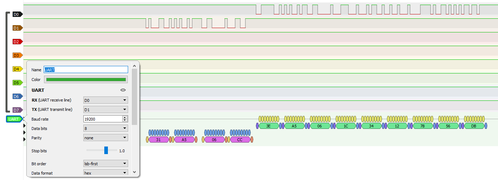

# Testwork_OmnicommLLS
Тестовое заданиие на работу.
Проект сделан для CubeIDE 1.7.0

Схема реализована на базе STM32F103C8T6, USB-UART переходника CP2102

Для отладки использовался логический анализатор, результат выглядит так:

Omnicomm_LLS - проект для МК здесь

В коде реализован расчет и проверка CRC входящего запроса, проверка кода запроса (06h), а также расчет CRC ответа

Чтение запроса побайтное, через прерывание, обработка в callback функции по флагу data_received_flag

Код написан на CMSIS, без HAL

Также добавлен скрипт на Python (Omnicomm_LLS_host), позволяющий отправлять пакет в порт и получать ответ на него от МК
